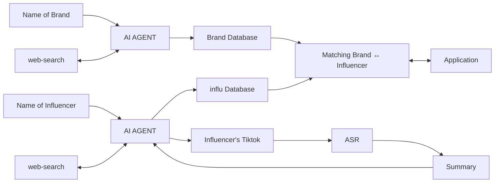

# Brand-Influencer Matching Platform

<div align="center">
  
  
  
  
  
</div>

## 📝 Overview
<div align="center">

</div>

A powerful platform that helps brands find the most suitable influencers for their marketing campaigns using AI-powered analysis and matching algorithms.

## ✨ Key Features

- **🔍 Influencer Discovery** - Find influencers that match your brand's identity
<div align="center">

</div>

- **🚀 Modern Interface** - Intuitive and user-friendly dashboard
- **📈 Smart Scoring** - Automated compatibility scoring system
- **📊 Compatibility Analysis** - In-depth analysis of brand-influencer compatibility

<div align="center">

</div>

- **📱 Detailed Profiles** - View comprehensive influencer insights and analytics
  
<div align="center">

</div>
<div align="center">

</div>

- ** 📤 Uploade New Influencers & Brands ** - Easy to update New influencer and Brands
  
<div align="center">

</div>
<div align="center">

</div>
<div align="center">

</div>

## 🛠️ Project Structure

```
projectA/
├── brand_influencer_matcher_backend/  # Backend (FastAPI)
│   ├── api/
│   │   └── endpoints/                # API endpoints
│   ├── models/                       # Database models
│   ├── services/                     # Business logic
│   └── main.py                       # FastAPI application
│
├── brand_influencer_matcher_frondend/  # Frontend (Next.js)
│   ├── app/                          # App router
│   ├── components/                   # React components
│   ├── lib/                          # Utility functions
│   └── public/                       # Static files
│
└── README.md                         # This file
```
## ༄ Project Flow

## 🚀 Installation

### 1. Clone the Repository

```bash
git clone https://github.com/Ink6220/brand_influencer_matcher_AI.git
cd brand_influencer_matcher_AI
```

### 2. Backend Setup

```bash
# Navigate to backend directory
cd brand_influencer_matcher_backend

# Create and activate virtual environment
python -m venv venv
source venv/bin/activate  # On Windows: venv\Scripts\activate

# Install dependencies
pip install -r requirements.txt

# Create .env file from example
cp .env.example .env

# Update environment variables
nano .env  # or open in your preferred editor
```

### 3. Frontend Setup

```bash
# Navigate to frontend directory
cd ../brand_influencer_matcher_frondend

# Install dependencies
npm install

# Create .env.local from example
cp .env.example .env.local

# Update environment variables
nano .env.local  # or open in your preferred editor
```

## 🚀 Running the Application

### 1. Start Backend Server

```bash
# From brand_influencer_matcher_backend directory
uvicorn main:app --reload
```

### 2. Start Frontend Development Server

```bash
# From brand_influencer_matcher_frondend directory
npm run dev
```

Open your browser and navigate to [http://localhost:3000](http://localhost:3000)

## 🔧 Environment Variables

### Backend (`.env`)

```
MONGODB_URL=mongodb://localhost:27017/brand_influencer
SECRET_KEY=your-secret-key
ALGORITHM=HS256
ACCESS_TOKEN_EXPIRE_MINUTES=30
```

### Frontend (`.env.local`)

```
NEXT_PUBLIC_API_URL=http://localhost:8000
```

## 📚 API Documentation

Once the application is running, you can access the API documentation at:
- Swagger UI: [http://localhost:8000/docs](http://localhost:8000/docs)
- ReDoc: [http://localhost:8000/redoc](http://localhost:8000/redoc)

## 🤝 Contributing

1. Fork the repository
2. Create your feature branch (`git checkout -b feature/AmazingFeature`)
3. Commit your changes (`git commit -m 'Add some AmazingFeature'`)
4. Push to the branch (`git push origin feature/AmazingFeature`)
5. Open a Pull Request

## 📄 License

Distributed under the MIT License. See `LICENSE` for more information.

## 🏞️ Environment

- Project Link: [https://github.com/Ink6220/brand_influencer_matcher_AI](https://github.com/Ink6220/brand_influencer_matcher_AI)

   **Set up environment variables**
   Create a `.env` file in the project root with the following variables:
   ```env
   # API Keys
   OPENAI_API_KEY=your_openai_api_key
   COHERE_API_KEY=your_cohere_api_key
   PINECONE_API_KEY=your_pinecone_api_key
   
   # Database Configuration
   MONGODB_URI=mongodb://localhost:27017
   DB_NAME=brand_influencer_db
   
   # Pinecone Configuration
   PINECONE_INDEX_NAME=influencer-analysis
   ```

## 🏃‍♂️ Running the Application

   **Start the FastAPI server**
   ```bash
   cd brand_influencer_matcher_Backend
   uvicorn main:app --reload
   ```


## 📚 API Endpoints

### Brands
- `POST /brands/` - Create a new brand profile
- `GET /brands/{brand_id}` - Get brand details
- `GET /brands/` - List all brands

### Influencers
- `POST /influencers/` - Add a new influencer
- `GET /influencers/{influencer_id}` - Get influencer details
- `GET /influencers/` - List all influencers

### Matches
- `POST /matches/find` - Find matching influencers for a brand
- `GET /matches/{match_id}` - Get match details

## 🤖 How It Works

1. **Data Ingestion**: Brands and influencers are added to the system with their profiles and content details
2. **Embedding Generation**: Text data is converted to vector embeddings using Cohere's multilingual model
3. **Vector Storage**: Embeddings are stored in Pinecone for efficient similarity search
4. **Matching**: The system finds the most similar influencers for a given brand using vector similarity
5. **Ranking**: Results are ranked based on relevance scores

## 📊 Data Models

### Influencer
```python
class InfluencerAnalysis(BaseModel):
    type_of_content: str
    target_audience: str
    positioning: str
    personality: str
    vision: str
```

## 🌐 Environment Variables

| Variable | Description | Required | Default |
|----------|-------------|----------|---------|
| `OPENAI_API_KEY` | API key for OpenAI services | Yes | - |
| `COHERE_API_KEY` | API key for Cohere services | Yes | - |
| `PINECONE_API_KEY` | API key for Pinecone vector database | Yes | - |
| `MONGODB_URI` | MongoDB connection string | No | `mongodb://localhost:27017` |
| `DB_NAME` | Database name | No | `brand_influencer_db` |
| `PINECONE_INDEX_NAME` | Name of the Pinecone index | No | `influencer-analysis` |


## 🙏 Acknowledgments

- FastAPI for the awesome web framework
- Pinecone for the vector database
- OpenAI and Cohere for the language models
- MongoDB for the flexible document database
